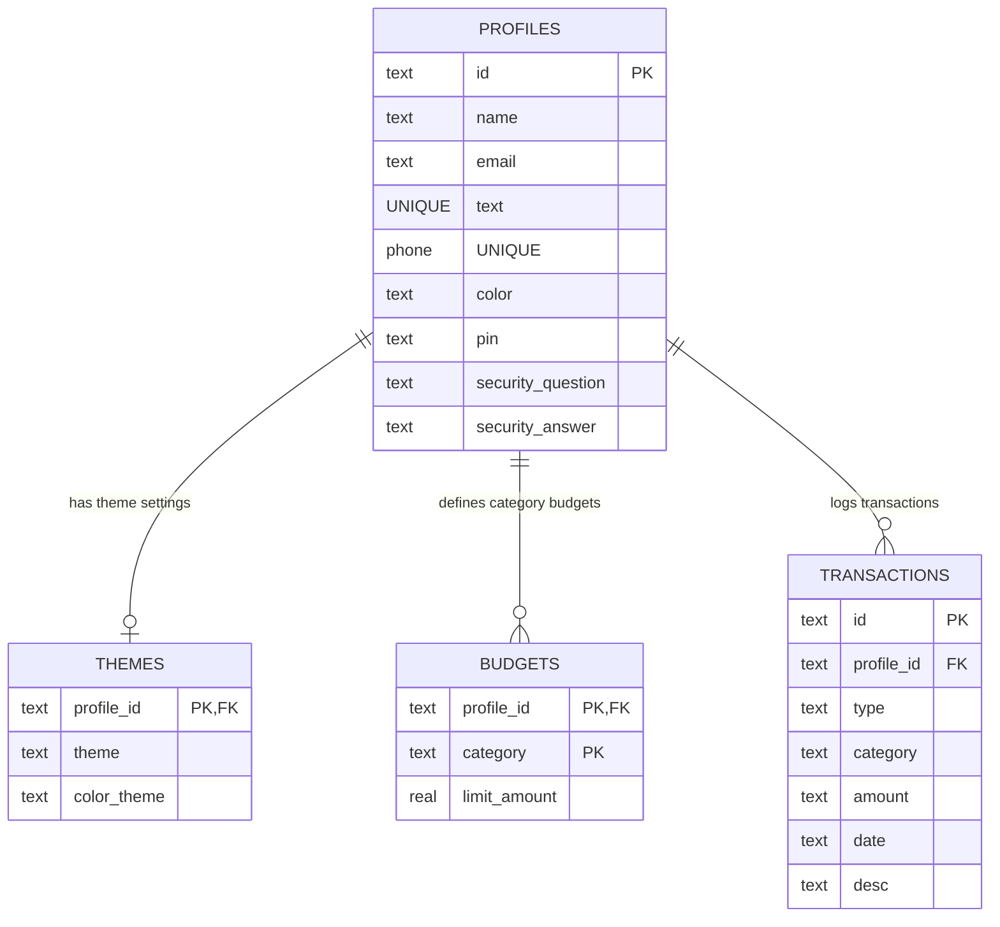

# Trackora - Full-Stack Mobile-First Personal Finance App
## Comprehensive Project Documentation

Trackora is a premium, mobile-first personal finance application and budget tracker supporting multi-user profiles on the same device. It features security PIN verification, interactive cubic-spline charts, custom onboarding tours, progressive web app (PWA) capabilities, and a live secure admin dashboard.

---

## 1. Core Features

### 💻 Premium Minimalist Monochrome UI/UX
* **High Contrast Styles**: Built around clean black and white color themes (pure `#000000` pitch-black dark mode and pure `#ffffff` light mode).
* **Single-Header Theme Toggle**: A moon/sun SVG toggle button allows instant swapping between dark and light modes.
* **Vector SVG Icons**: 100% vector line icons render identically across all screen resolutions (no system-dependent emojis).
* **Custom iOS-Style Scrollbars**: Sleek, theme-aware scrollbars styled with `var(--color-primary)` on hover.

### 👤 Multi-User Profiles & Security PIN Lock
* **Direct Sign In / Sign Up**: Users register with a Name, Email, Phone Number, and a custom Security Question & Answer.
* **Keypad PIN Setup & Unlock**: Secures each user profile with a 4-digit security PIN required on page reload or profile switching.
* **Identity Verification (PIN Recovery)**: Custom security question and answer verification to reset forgotten PINs.
* **Profile Deletion Security**: Replaces raw browser alerts with a dedicated PIN verification screen to cascade-delete profiles securely.

### 📊 Interactive Analytics & Charts
* **Cubic Spline Chart**: Smooth vector line graph with interval toggling (Weekly, Monthly, Yearly).
* **Hover Interaction**: Tapping on coordinate nodes displays exact dates and spend amounts in the card header.
* **Vibrant Breakdowns**: A multi-color category donut chart, budget progress indicators, and transaction lists leverage high-contrast category markers.

### 🧭 Interactive Onboarding Tour
* **Step-by-Step Tooltips**: Automatically guides new users through the Avatar switcher, Balance cards, Stats row, Chart, Budgets, and the Add Button.
* **Tour Triggers**: Starts automatically on first login and is launchable manually from the Settings Drawer.

### 🚀 Progressive Web App (PWA)
* **Installable**: Includes a service worker (`sw.js`) and manifest metadata (`manifest.json`) enabling users to install Trackora as an application on Android, iOS, and Desktop.

### 🔒 Live Admin Dashboard (`/admin`)
* **Live Directory**: A private, passcode-secured URL that displays the total number of profiles and list details in real-time.

---

## 2. Technical Architecture

Trackora runs a full-stack architecture separating the client-side UI and the relational database:

```
[ Android App (APK) ] OR [ Web Browser (PWA) ]
                       │
             HTTPS REST requests
                       ▼
    [ Python Flask Server (PythonAnywhere) ]
                       │
                 SQLite Queries
                       ▼
           [ SQLite Database (database.db) ]
```

* **Frontend**: HTML5, Vanilla CSS3 (utilizing custom variables), and Vanilla JavaScript (`app.js`).
* **Backend**: Python 3 and Flask microframework (`server.py`).
* **Database**: SQLite3 (`database.db`) with foreign keys enabled (`PRAGMA foreign_keys = ON`).

---

## 3. Database Schema

The SQLite schema consists of 4 tables connected via foreign keys with cascading deletions enabled:



### 3.1 Profiles Table (`profiles`)
Stores account metadata and identity secrets.
* `id` (TEXT PRIMARY KEY): Unique identifier (e.g. `p-bef8311d1d7b`).
* `name` (TEXT)
* `email` (TEXT UNIQUE)
* `phone` (TEXT UNIQUE)
* `color` (TEXT): Visual profile badge color.
* `pin` (TEXT): 4-digit security PIN.
* `security_question` (TEXT)
* `security_answer` (TEXT): Case-insensitive answer.

### 3.2 Transactions Table (`transactions`)
Records user earnings and expenses.
* `id` (TEXT PRIMARY KEY)
* `profile_id` (TEXT, FOREIGN KEY REFERENCES `profiles(id) ON DELETE CASCADE`)
* `type` (TEXT): Either `'income'` or `'expense'`.
* `category` (TEXT): Food, Shopping, Transport, Utilities, Entertainment, or Other.
* `amount` (REAL)
* `date` (TEXT): Date in `YYYY-MM-DD` format.
* `desc` (TEXT)

### 3.3 Budgets Table (`budgets`)
Maintains limits for spending categories.
* `profile_id` (TEXT, FOREIGN KEY REFERENCES `profiles(id) ON DELETE CASCADE`)
* `category` (TEXT)
* `limit_amount` (REAL)
* *Composite Primary Key*: `(profile_id, category)`

### 3.4 Themes Table (`themes`)
Custom UI styling preferences.
* `profile_id` (TEXT PRIMARY KEY, FOREIGN KEY REFERENCES `profiles(id) ON DELETE CASCADE`)
* `theme` (TEXT): `'dark'` or `'light'`.
* `color_theme` (TEXT): Midnight, Cyberpunk, Sunset, Emerald, Ocean, or Monochrome.

---

## 4. API Endpoints

All communication between the frontend client and the backend server happens via REST API routes:

| Method | Endpoint | Description |
| :--- | :--- | :--- |
| **GET** | `/` | Serves the main frontend `index.html` |
| **GET** | `/api/profiles` | Retrieves list of all registered profile name badges |
| **POST** | `/api/profiles/signup` | Registers a new profile and seeds default budgets/themes |
| **POST** | `/api/profiles/signin` | Validates profile existence via Email/Mobile |
| **POST** | `/api/profiles/verify-pin` | Verifies PIN entry matching profile |
| **POST** | `/api/profiles/setup-pin` | Saves a newly defined PIN for a profile |
| **GET** | `/api/profile/<id>/security-question` | Fetches custom security question for password recovery |
| **POST** | `/api/profiles/verify-identity` | Validates security question answer to reset PIN |
| **GET** | `/api/profile/<id>/state` | Returns budgets, transaction records, and theme settings |
| **POST** | `/api/profile/<id>/transactions` | Saves a new ledger transaction |
| **DELETE**| `/api/profile/<id>/transactions/<tx_id>` | Erases a transaction |
| **POST** | `/api/profile/<id>/budgets` | Modifies category budget caps |
| **POST** | `/api/profile/<id>/theme` | Saves active light/dark/accent choices |
| **POST** | `/api/profile/<id>/reset` | Erases all transactions of the profile |
| **DELETE**| `/api/profile/<id>` | Erases profile and cascades all child tables |
| **GET** | `/db` | Renders the HTML active user directory (live dashboard) |

---

## 5. Local Development Setup

To run this application locally on your computer:

### 5.1 Run the Python Backend
1. Ensure Python 3 is installed.
2. In the terminal inside the project directory, install dependencies:
   ```bash
   pip install -r requirements.txt
   ```
3. Run the development server:
   ```bash
   python server.py
   ```
   The backend will run on `http://localhost:5000` (and expose to LAN at port `5000`).

### 5.2 Run the Frontend
You can run Vite to compile assets dynamically:
1. Ensure Node.js is installed.
2. Run installation and development server:
   ```bash
   npm install
   npm run dev
   ```

---

## 6. Production Deployment Guide (PythonAnywhere)

PythonAnywhere is recommended because it provides free, persistent file storage, meaning your SQLite database will never be deleted or reset.

### 6.1 Clone the Code
1. Open a **Bash Console** in your PythonAnywhere account.
2. Clone your repository:
   ```bash
   git clone https://github.com/YOUR_GITHUB_USERNAME/finance-tracker.git
   ```
3. Install Flask:
   ```bash
   pip install --user flask
   ```

### 6.2 Set Up the Web App
1. Go to the **Web** tab on PythonAnywhere.
2. Click **Add a new web app**, choose **Manual Configuration**, and select **Python 3.10**.
3. In the Web Settings:
   * **Source code**: `/home/YOUR_USERNAME/finance-tracker`
   * **Working directory**: `/home/YOUR_USERNAME/finance-tracker`

### 6.3 Update the WSGI Configuration
1. Click the **WSGI Configuration File** link in your Web settings.
2. Replace everything inside it with:
   ```python
   import sys
   import os

   path = '/home/YOUR_USERNAME/finance-tracker'
   if path not in sys.path:
       sys.path.insert(0, path)

   # Secure persistent SQLite directory
   os.environ['DATABASE_PATH'] = '/home/YOUR_USERNAME/finance-tracker/database.db'

   from server import app as application
   ```
3. Save the WSGI file. Go back to the Web dashboard and click **Reload**.
4. Your application is now live at `https://YOUR_USERNAME.pythonanywhere.com`!

---

## 7. App Administration (Admin Dashboard)

To view your registered users in real-time, navigate to your dashboard:

* **URL**: `https://YOUR_USERNAME.pythonanywhere.com/db` (the path itself acts as the passcode)

This dashboard is a **live, read-only directory** showing:
1. **Total Registered Profiles**: Overall account count.
2. **User Profiles Table**: Displays each user's Name (with theme indicator), unique ID, Email, Phone Number, and whether they have set up a security PIN.

---

## 8. Compiling the Standalone APK (Android)

To pack your online URL into a standalone, fullscreen mobile application with your custom logo and no browser address bar:

1. Open your browser and go to **[Web2Apk](https://www.web2apk.com/)**.
2. Fill out the application profile:
   * **Website URL**: `https://YOUR_USERNAME.pythonanywhere.com` (Use `https` to prevent cleartext block errors).
   * **App Title**: `Trackora`
3. Click **Build My App!**.
4. Download the generated `.apk` file.
5. Transfer it to any Android device, install, and run. It will display the app icon on the home screen and load directly into standalone fullscreen mode connected to the database!
